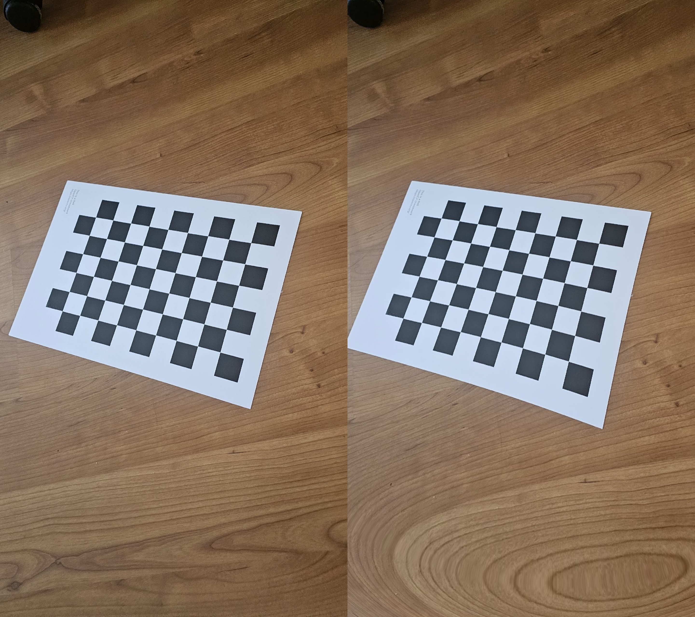
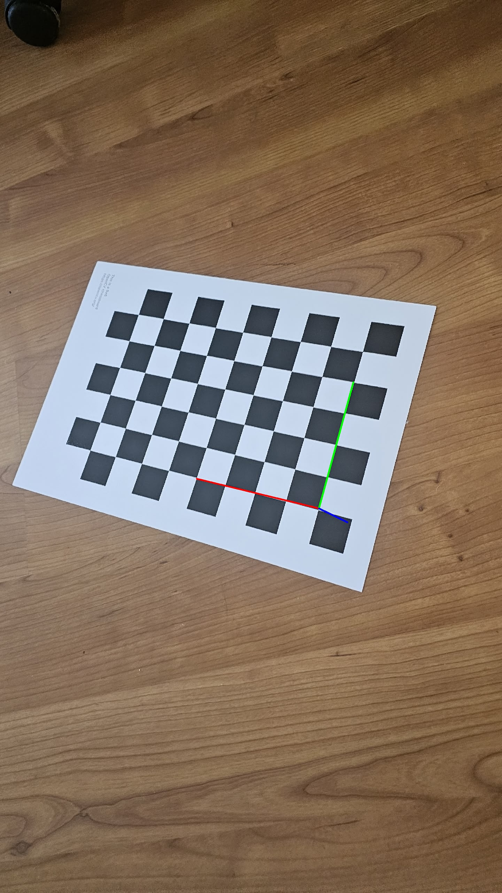

**Mean Reprojection Error: ~0.18–0.26 pixels**

# Day 5 - Camera Calibration

## Results

### Before vs After

  

### Coordinate Axes



## Goal

The goal of this project is to learn how to calibrate a real camera using a chessboard pattern and understand the results of the calibration.

After this project, I can:

* Use a set of chessboard calibration images
* Detect chessboard corners
* Refine the detected corner positions
* Use `cv2.calibrateCamera()`
* Get the camera matrix `K`
* Get distortion coefficients
* Calculate the mean reprojection error
* Use camera parameters to undistort images
* Visualize the camera coordinate axes

Camera calibration is an important step in many Computer Vision and 3D applications.

## Why Camera Calibration Is Needed

A real camera has some distortion, so the image is not always a perfect representation of the real world.

Camera calibration helps find the camera parameters that describe how 3D points are projected onto a 2D image.

Calibration is used in many areas, for example:

* Structure-from-Motion and COLMAP
* 3D reconstruction
* Augmented Reality
* Robotics and SLAM
* Measurements from images
* Photogrammetry
* Scan-to-BIM

If the camera parameters are not accurate, later 3D calculations can also contain errors.

## Capture Conditions

* Real smartphone photos
* Uncontrolled indoor lighting
* Different angles, distances and positions of the chessboard

Using real smartphone photos makes the calibration more realistic, but also introduces more variation than a controlled or synthetic dataset.

## Project Structure

```text
day5_calibration/

│
├── calibration_images/
│   ├── image1.jpg
│   ├── image2.jpg
│   ├── image3.jpg
│   └── ...
│
├── results/
│   ├── corners_image1.jpg
│   ├── corners_image2.jpg
│   ├── camera_calibration.npz
│   ├── axes_visualization.jpg
│   ├── comparison_1.jpg
│   ├── comparison_2.jpg
│   └── comparison_3.jpg
│
└── calibration.py
```

## Requirements

Python 3 is required.

Install the libraries:

```bash
pip install opencv-python numpy
```

## Calibration Board

The project uses a chessboard with:

```python
CHESSBOARD_SIZE = (9, 6)
```

This means the program looks for 9 by 6 inner corners.

The size of one chessboard square is:

```python
SQUARE_SIZE = 0.025
```

The size is given in meters, so one square is 0.025 m.

## How the Program Works

### 1. Find Calibration Images

The program searches for `.jpg`, `.jpeg`, and `.png` files inside the calibration images folder.

```python
images = (
    glob.glob(os.path.join(CALIBRATION_FOLDER, "*.jpg"))
    + glob.glob(os.path.join(CALIBRATION_FOLDER, "*.jpeg"))
    + glob.glob(os.path.join(CALIBRATION_FOLDER, "*.png"))
)
```

If no images are found, the program stops.

### 2. Create 3D Points

The program creates the real 3D coordinates of the chessboard corners.

The chessboard is considered to be on the same plane, so the Z coordinate is 0.

These points are stored in `objpoints`.

### 3. Detect Chessboard Corners

For every image, OpenCV tries to find the chessboard corners using:

```python
cv2.findChessboardCorners()
```

If the corners are found, their positions are refined using:

```python
cv2.cornerSubPix()
```

The 3D chessboard points and detected 2D image points are then saved.

Images with detected corners are also saved in the `results` folder.

### 4. Camera Calibration

After processing all images, the program uses:

```python
cv2.calibrateCamera()
```

It returns:

```python
ret, K, dist, rvecs, tvecs
```

These values contain the main camera calibration results.

## Calibration Results

### Intrinsic Matrix K

The camera matrix contains the main intrinsic parameters of the camera.

The matrix has the following form:

```text
[[fx  0  cx]
 [ 0 fy  cy]
 [ 0  0   1]]
```

Where:

* `fx` - focal length in the X direction
* `fy` - focal length in the Y direction
* `cx` - principal point X coordinate
* `cy` - principal point Y coordinate

The actual matrix is calculated by OpenCV from the calibration images and printed by the program:

```python
print(K)
```

### Distortion Coefficients

The distortion coefficients describe how the camera lens changes the image.

The coefficients are represented as:

```text
[k1, k2, p1, p2, k3]
```

Where:

* `k1`, `k2`, `k3` - radial distortion coefficients
* `p1`, `p2` - tangential distortion coefficients

The program prints the calculated values using:

```python
print(dist)
```

These parameters are later used to correct lens distortion.

### Reprojection Error

The program projects the 3D chessboard points back onto the image using the calculated camera parameters.

The difference between the original detected points and the projected points is the reprojection error.

The program calculates the error for every calibration image and then calculates the mean error:

```python
mean_error = total_error / len(objpoints)
```

The final mean reprojection error is approximately:

```text
~0.18–0.26 pixels
```

This means that, on average, the projected chessboard points are very close to the detected image points.

A lower reprojection error means that the calculated camera parameters fit the detected calibration points more closely. The error should still be interpreted together with the calibration images and the quality of corner detection.

## Undistortion

After calibration, the camera matrix and distortion coefficients can be used to correct images.

The project uses:

```python
cv2.undistort()
```

The program creates comparison images showing:

```text
Original | Undistorted
```

The first three calibration images are used as examples.

The results are saved as:

```text
comparison_1.jpg
comparison_2.jpg
comparison_3.jpg
```

The comparison images show how the estimated lens distortion changes the appearance of the original image.

## Coordinate Axes

The project also visualizes 3D coordinate axes on one of the calibration images.

It uses:

```python
cv2.drawFrameAxes()
```

The result is saved as:

```text
axes_visualization.jpg
```

This helps visualize the camera pose relative to the chessboard and connects the 2D calibration result with a 3D coordinate system.

## Saved Calibration Parameters

The main calibration parameters are saved to:

```text
camera_calibration.npz
```

The file contains:

* `K` - camera matrix
* `dist` - distortion coefficients
* `image_width` - image width
* `image_height` - image height

These parameters can be loaded later without running the calibration again.

For example:

```python
data = np.load("camera_calibration.npz")

K = data["K"]
dist = data["dist"]
```

This makes it possible to reuse the calibration results in other Computer Vision or 3D projects.

## Final Output

At the end of the program, the main results are printed:

```text
================================
FINAL CALIBRATION PARAMETERS
================================

1. Mean reprojection error:
~0.18–0.26 pixels

2. Camera matrix K:
[[fx  0  cx]
 [ 0 fy  cy]
 [ 0  0   1]]

3. Distortion coefficients:
[k1, k2, p1, p2, k3]
```

The exact values of `K` and the distortion coefficients depend on the camera and the calibration images.

## Results Folder

After running the program, the `results` folder contains:

* `camera_calibration.npz` - saved camera parameters
* `corners_*.jpg` - images with detected chessboard corners
* `axes_visualization.jpg` - coordinate axes on a calibration image
* `comparison_*.jpg` - original and undistorted images

## How to Run

Put the chessboard images into:

```text
calibration_images/
```

Then run:

```bash
python calibration.py
```

The program will:

1. Find the calibration images
2. Detect the chessboard corners
3. Refine the detected corners
4. Calibrate the camera
5. Calculate the reprojection error
6. Save the camera parameters
7. Create undistortion comparisons
8. Create a coordinate axes visualization

## What I Learned

* Full calibration pipeline with OpenCV
* How to evaluate calibration quality using reprojection error
* Why real smartphone data is harder than synthetic
* How to save and reuse camera parameters

This project gave me a complete basic camera calibration pipeline that can be used as a starting point for more advanced 3D Computer Vision tasks.
